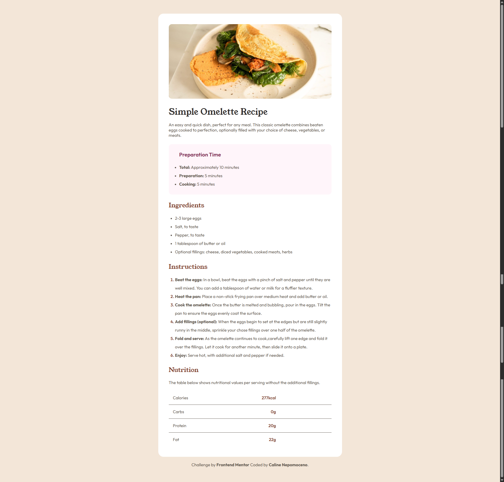

# 🍳 Recipe Page

[](https://img.shields.io/badge/HTML5-E34F26?style=for-the-badge&logo=html5&logoColor=white) [](https://img.shields.io/badge/CSS3-1572B6?style=for-the-badge&logo=css3&logoColor=white)

Resolução do desafio **Recipe Page** do [Frontend Mentor](https://www.frontendmentor.io/). O objetivo foi construir uma página de receita organizada em seções (preparo, ingredientes, instruções e informações nutricionais), com boa hierarquia visual e tipografia combinando duas fontes.

🔗 **[🚀 Clique aqui para ver o projeto online](https://acali10.github.io/RecipePage/)**

---

## 📷 Demonstração



---

## 🛠️ Tecnologias e Conceitos Aplicados

- **HTML5 Semântico:** uso de `<main>`, `<dl>`/`<dt>`/`<dd>` para a tabela nutricional e `<footer>` para estruturar o conteúdo de forma acessível.
- **CSS Nesting:** aninhamento nativo de seletores dentro de `body`, `.card`, `.preparation`, `.ingredients` e `.instructions` para agrupar os estilos dos elementos filhos.
- **Variáveis CSS (`:root`):** paleta de cores centralizada (`--White`, `--Stone100`, `--Stone600`, `--Brown800`, `--Rose800`, etc.) para facilitar reuso e manutenção.
- **Flexbox + Sticky Layout:** `body` com `min-height: 100vh` e `flex-direction: column`, combinado com `main { flex: 1 }` para manter o conteúdo centralizado verticalmente na tela.
- **Responsividade fluida com `clamp()`:** padding do `.card` se ajusta suavemente entre um mínimo e um máximo conforme a largura da tela, sem depender de media queries.
- **Customização de marcadores:** uso de `li::marker` para estilizar a numeração da lista de instruções com a cor de destaque do projeto.
- **Tipografia Externa:** importação das fontes **Young Serif** (títulos) e **Outfit** (corpo do texto) do Google Fonts.

---

## 💡 O que aprendi

Um dos pontos principais do projeto foi usar o CSS Nesting para organizar os estilos por seção sem repetir seletores pai:

```css
.instructions{
    ol{
        margin: 1rem 0 1.5rem 1.5rem;
        line-height: 2rem;
    }
    h2{
        color: var(--Brown800);
    }
    ol li::marker{
        color: var(--Brown800);
        font-weight: 600;
    }
}
```

Isso deixa claro, só de olhar o bloco, quais elementos pertencem a qual seção da página, sem precisar escrever `.instructions ol`, `.instructions h2` etc. separadamente.

Também reforcei o uso de `clamp()` para paddings fluidos:

```css
.card{
    padding: clamp(1.5rem, 6vw, 2.5rem) clamp(1.25rem, 6vw, 2.5rem);
}
```

O valor do meio (`6vw`) acompanha a largura da tela, enquanto os valores mínimo e máximo evitam espaçamentos extremos.

---

## 💻 Como rodar o projeto localmente

1. Clone o repositório:

```
git clone https://acali10.github.io/RecipePage.git
```

2. Acesse a pasta do projeto:

```
cd RecipePage
```

3. Abra o arquivo `index.html` em seu navegador.

---

## 🔜 Melhorias futuras

- Converter a imagem do prato para `.webp` visando otimização de carregamento.
- Adicionar suporte a diferentes tamanhos de porção, recalculando os valores nutricionais.
- Melhorar a responsividade da tabela de informações nutricionais em telas muito pequenas.

---

## 👤 Autora

Desenvolvido por Caline Nepomoceno:

- GitHub: [@acali10](https://github.com/acali10)
- Frontend Mentor: [@acali10](https://www.frontendmentor.io/profile/acali10)
